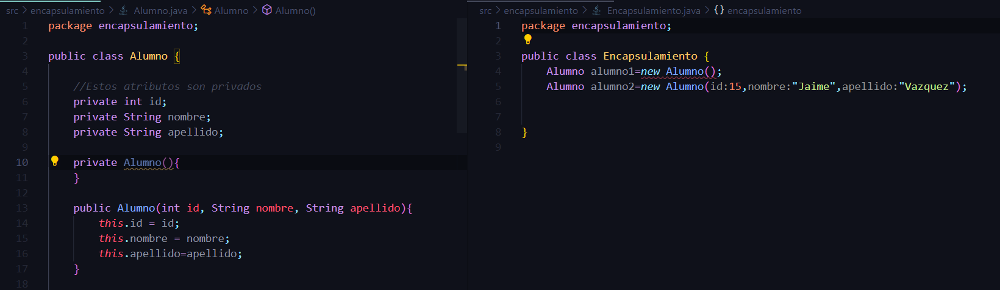

# JAVA_POO


La Programación Orientada a Objetos (POO) es un paradigma de programación que se basa en el concepto de "objetos". Los objetos son instancias de clases, y las clases son plantillas que definen la estructura y el comportamiento de esos objetos. Java es un lenguaje de programación que sigue el paradigma de la POO de manera sólida.

---

## POO con JAVA

### I. Introducción

Paradigma: Es todo modelo, patron o ejemplo que debe seguirse en determinada situación.

POO: Se basa en la idea de un mundo lleno de objetos y que la resolución de problemas se realiza mediante el modelo/abstracción de objetos de la vida real.

Objetos: Los objetos pueden comunicarse entre sí mediante mensajes.

Características:

1. Abstracción
2. Encapsulamiento
3. Polimorfismo
4. Herencia
5. UML (Lenguaje Universidad de Modelado)

### II. ABSTRACCION

La abstracción implica crear clases y objetos que representen entidades del mundo real, pero sin tener que modelar cada detalle de esas entidades. Por ejemplo, si estás trabajando en un programa que gestiona una biblioteca, puedes abstraer un libro como un objeto con propiedades como título, autor y número de páginas, sin necesidad de conocer todos los detalles internos de cómo se almacena la información en la base de datos o cómo se imprime el libro físicamente.


### III. CLASES

Es una plantilla, o molde que permite construir objetos. Por ejemplo, si tuviéramos la clase Auto, ésta sería el plano para construir el Objeto (en este caso uno o varios autos)

```java
    public class Alumno { //clase Alumno

      //Atributos de la clase Alumno
      int id;
      String nombre;
      String apellido;

}
```

### IV. METODOS en JAVA

Metodos son acciones contenidos en una clase, y definen su comportamiento
Dentro de un sistema las operaciones suelen detectarse como verbos en infinitivo

```java
//Acciones o Metodos
    public void mostrarNombre(){ //modificador de acceso-tipo de dato-nombre del metodo
        System.out.println("Mi nombre es Jaime Vazquez S");
    }

    public void saberAprobado(double calificacion){
        if(calificacion >= 6){
            System.out.println("Aprobe la materia");
        }else{
            System.out.println("Reprobe");
        }

    }
```

### V. METODOS CONSTRUCTORES y OBJETOS en JAVA

1. Objetos: Un objeto es una instancia de una clase


Es la representacion de un objeto que generalmente existe en la vida real.

2. Constructores: Son funciones especiales que contienen las clases para permitir la creacion de objetos. Se llaman SIEMPRE igual que la clase

Tipos:

Constructor vacío

Constructor con todos los parametros

```java

public class Alumno {

    //Atributos de la clase Alumno
    int id;
    String nombre;
    String apellido;

    public Alumno() { //Constructor vacío     
    }

    //Objeto Alumno
    public Alumno(int id, String nombre, String apellido){ 
        this.id = id;
        this.nombre = nombre;
        this.apellido = apellido;
    }

    //Acciones o Metodos
    public void mostrarNombre(){ //modificador de acceso-tipo de dato-nombre del metodo
        System.out.println("Mi nombre es Jaime Vazquez S");
    }
}

```

```java
public class POO {
    public static void main(String[] args){
        
        Alumno alu1 = new Alumno ();
        Alumno alu2 = new Alumno (2, "Jaime", "Vazquez");

    }
}
```

### VI. Get (Traer) y Set (Colocar o Modificar)

```java
public class Alumno {

    //Atributos de la clase Alumno
    int id;
    String nombre;
    String apellido;

    public Alumno() { //Constructor vacío     
    }

    //Objeto Alumno
    public Alumno(int id, String nombre, String apellido){ 
        this.id = id;
        this.nombre = nombre;
        this.apellido = apellido;
    }

    //Get = Traer
    public int getId(){
        return id;
    }

    public String getNombre(){
        return nombre;
    }

    public String getApellido(){
        return apellido;
    }

    // SET = Colocar
    public void setid(int id) {
        this.id = id;
    }

    public void setnombre(String nombre) {
        this.nombre = nombre;
    }

    public void setapellido(String apellido) {
        this.apellido =apellido;
    }
}
```

```java
    public class POO {
    public static void main(String[] args) {

        Alumno alu1 = new Alumno();
        Alumno alu2 = new Alumno(2, "Jaime", "Vazquez");

        System.out.println("-------------------------------");
        // Get = Traer
        System.out.println("La id del alumno 2 es: " + alu2.getId());
        System.out.println("El nombre es: " + alu2.getNombre());
        System.out.println("El apellido es: " + alu2.getApellido());

        System.out.println("-------------------------------");
        // SET = Colocar o Modificar
        alu1.setid(8);
        alu1.setnombre("Luis");
        alu1.setapellido("Ortiz");

        System.out.println("La id del alumno 1 es: " + alu1.getId());
        System.out.println("El nombre es: " + alu1.getNombre());
        System.out.println("El apellido es: " + alu1.getApellido());

        System.out.println("-------------------------------");
        alu1.setid(35); //Cambio de valor, lo estoy sobrescribiendo

        System.out.println("La id del alumno 1 es: " + alu1.getId());
        System.out.println("El nombre es: " + alu1.getNombre());
        System.out.println("El apellido es: " + alu1.getApellido());

    }
}


```

### VIII. HERENCIA en JAVA

Hay clases que comparten gran parte de sus características. 

El mecanismo conocido con el nombre de herencia permite reutilizar clases: Se crea una nueva clase que extiende la funcionalidad de una clase existente sin tener que reescribir el código asociado a esta última.

La nueva clase, a la que se denomina subclase, puede poseer atributos y métodos que no existan en la clase original. 


**Clase Persona.java**
```java
package herencia;

public class Persona {
    int id;
    String dni;
    String nombre;
    String apellido;
    String domicilio;
    String telefono;

    public Persona(){
    }

    public Persona(int id,String dni, String nombre, String apellido, String domicilio, String telefono){
        this.id=id;
        this.dni=dni;
        this.nombre=nombre;
        this.apellido=apellido;
        this.domicilio=domicilio;
        this.telefono=telefono;
    }

    public int getId() {
        return id;
    }

    public void setId(int id) {
        this.id = id;
    }

    public String getDni() {
        return dni;
    }

    public void setDni(String dni) {
        this.dni = dni;
    }

    public String getNombre() {
        return nombre;
    }

    public void setNombre(String nombre) {
        this.nombre = nombre;
    }

    public String getApellido() {
        return apellido;
    }

    public void setApellido(String apellido) {
        this.apellido = apellido;
    }

    public String getDomicilio() {
        return domicilio;
    }

    public void setDomicilio(String domicilio) {
        this.domicilio = domicilio;
    }

    public String getTelefono() {
        return telefono;
    }

    public void setTelefono(String telefono) {
        this.telefono = telefono;
    }


    
}
```

**Clase Empleado.java**

```java
package herencia;

public class Empleado extends Persona { // extends Persona <--ya tengo una relacion entre la clase Empleado y Persona

    int num_legajo;
    String cargo;
    Double sueldo;

    public Empleado() {
    }

    // Atributos que hereda (id, dni, nombre, apellido, domicilio, telefono)
    public Empleado(int num_legajo, String cargo, Double sueldo, int id, String dni, String nombre, String apellido,
            String domicilio, String telefono) {
        super(id, dni, nombre, apellido, domicilio, telefono);
        this.num_legajo = num_legajo;
        this.cargo = cargo;
        this.sueldo = sueldo;
    }

    public int getNum_legajo() {
        return num_legajo;
    }

    public void setNum_legajo(int num_legajo) {
        this.num_legajo = num_legajo;
    }

    public String getCargo() {
        return cargo;
    }

    public void setCargo(String cargo) {
        this.cargo = cargo;
    }

    public Double getSueldo() {
        return sueldo;
    }

    public void setSueldo(Double sueldo) {
        this.sueldo = sueldo;
    }

    
}
```

**Clase Consultor.java**

```java
package herencia;

public class Consultor extends Persona{ // extends Persona <--ya tengo una relacion entre la clase Consultor y Persona
    String nombre_consultora;
    int num_consultos;

    public Consultor(){
    }

    public Consultor(int id, String dni, String nombre, String apellido, String domicilio, String telefono,
            String nombre_consultora, int num_consultos) {
        super(id, dni, nombre, apellido, domicilio, telefono);
        this.nombre_consultora = nombre_consultora;
        this.num_consultos = num_consultos;
    }

    public String getNombre_consultora() {
        return nombre_consultora;
    }

    public void setNombre_consultora(String nombre_consultora) {
        this.nombre_consultora = nombre_consultora;
    }

    public int getNum_consultos() {
        return num_consultos;
    }

    public void setNum_consultos(int num_consultos) {
        this.num_consultos = num_consultos;
    }

    

    
}

```

**Clase Herencia.java**

```java
package herencia;
public class Herencia {

    public static void main(String[] args){
        Empleado empleado1 = new Empleado();
        empleado1.getNum_legajo(); 
        empleado1.getId();
        empleado1.getNombre();


        Consultor consultor1 =new Consultor();
        consultor1.getNombre_consultora();
        consultor1.getApellido();
        consultor1.getNombre();


    }

}

```

### IX. POLIMORFISMO en JAVA

POLI=Muchas

Morfismo=Formas

A partir de un objeto que pertenece a una clase madre o interfaz, puedo tener objetos con clases hijas que comparten atributos y métodos comunes. Esto permite que objetos de clases distintas se consideren como si tuvieran la forma de un solo objeto, lo que facilita su manipulación de manera cohesiva dentro de un programa.


**Clase Jefe.java**

```java
package herencia;

public class Jefe extends Persona {
    int id_jefe;
    String departamento_jefe;

    public Jefe() {
    }

    public Jefe(int id_jefe, String departamento_jefe, int id, String dni, String nombre, String apellido,
            String domicilio, String telefono) {
        super(id, dni, nombre, apellido, domicilio, telefono);
        this.id_jefe = id_jefe;
        this.departamento_jefe = departamento_jefe;

    }

    public int getId_jefe() {
        return id_jefe;
    }

    public void setId_jefe(int id_jefe) {
        this.id_jefe = id_jefe;
    }

    public String getDepartamento_jefe() {
        return departamento_jefe;
    }

    public void setDepartamento_jefe(String departamento_jefe) {
        this.departamento_jefe = departamento_jefe;
    }

}
    
```

**Clase Herencia.java**

```java
    package herencia;

public class Herencia {

    public static void main(String[] args) {
        Persona vector[] = new Persona[5]; //las clases empleado, consultro y jefe son clases hijas y son formas diferentes de representar una misma persona me permite que en un vector que pertenesca a la clases padre yo pueda guardar distintos tipos que pertenescan a clases hijas  
        vector[0] = new Persona(); // Clase Madre
        vector[1] = new Empleado(); // Clase hija
        vector[2] = new Consultor();// Clase hija
        vector[3] = new Jefe(); // Clase hija

        Persona perso=new Persona();
        Consultor consul=new Consultor();

        perso=consul;
    }

}

```

### X. ENCAPSULAMIENTO en JAVA

Encapsulamiento: Significa reunir a todos los elementos que pueden considerarse pertenencientes a una misma entidad, al mismo nivel de abstracción. 

Principio de Ocultación: Cada objeto está aislado y únicamente expone una interfaz a otros objetos donde especifica cómo pueden unteractuar con él. 


**El encapsulamiento permite 3 niveles de acceso:**
+ PUBLIC (Público): Todo Atributo o Metodo que tenga PUBLIC adelante puede ser utilizado desde cualquier clase, posicion que tengamos dentro de nuestra aplicacion. 
+ PRIVATE (Privado): Si es privado unicamente se puede decalarar dentro de la clase donde esta declarado o donde esta especificado 
+ PROTECTED (Protegido): Es un intermedio entre privado y público. Establece que el acceso de los métodos o atributos que estén declarados de esta manera solo puede ser utilizado dentro de la misma clase, también en sus clases hijas cuando se aplica herencia.



Como podemos ver en la imagen an la clase Alumno declaramos el constructor vacio como privado y podemos ver que en la clase Encapsulamiento podemos ver como tenemos un error cuando creamos el alumno1, ya que el error nos dice que debemos crear el constructor Alumno, pero si ya esta creado, eso es por que esta PRIVATE. 


### XI. CLASES ABSTRACTAS en JAVA

Son un tipo particulas de clase cuyo principal características es que NO PUEDEN ser instanciarse.

Cuando se usan clases abstractas una clase no puede heredar de varias clases abstractas a la vez (como es en el casso de lass interfaces)

¿Cuándo se usan las Clases Abstractas?
Cuando deseamos definir una abstraccion que engloba objetos de distintos tipos y queremos hacer uso del polimorfismo. 


